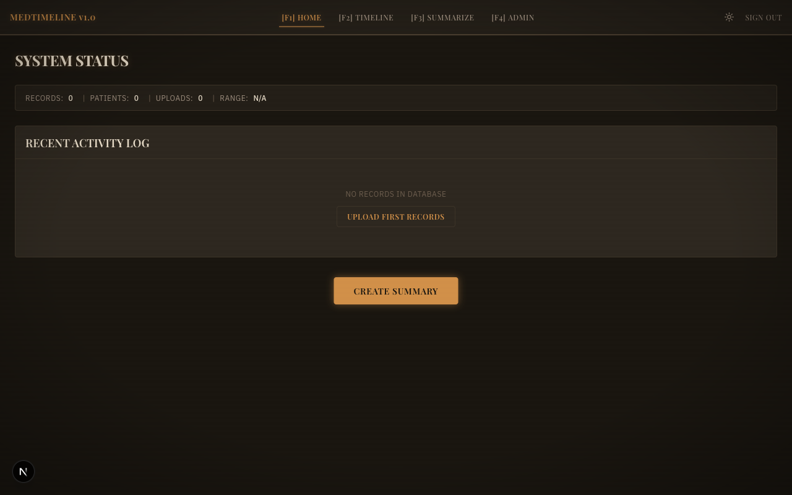

# MedTimeline

Puts medical records from different formats into one place. Reads FHIR R4 bundles, Epic EHI exports (TSV), and scanned documents (PDF, RTF, TIFF), stores everything in PostgreSQL, and shows it on a timeline.

AI is optional. Without an API key you still get record ingestion, a timeline, and de-identified prompt building you can paste into whatever LLM you want. Add a Gemini key and it'll also extract text from scans, pull out clinical entities, and generate summaries. Health data gets de-identified before any AI call — the PHI scrubber strips all 18 HIPAA identifier types.



<!-- TODO: Seed a test account with synthetic clinical data (Synthea or similar)
     for richer screenshots. See: https://synthea.mitre.org/ -->

## What it does

- Parses FHIR R4 JSON bundles and Epic EHI Tables (14 mappers) into a normalized PostgreSQL schema
- Extracts text from PDFs, RTFs, and TIFFs via Gemini vision API
- Identifies clinical entities (meds, conditions, labs, vitals, procedures, allergies, providers) with confidence scores
- Lets you review extracted entities before they become FHIR records
- Batch upload for multiple documents at once
- Timeline view with filtering by record type
- Builds de-identified prompts you can paste into any LLM (no API key needed)
- Optionally calls Gemini for live summarization (text, JSON, or both)
- Finds duplicates with exact + fuzzy matching, then lets you merge or dismiss them

On the HIPAA side: AES-256 encryption at rest, audit logging on every data endpoint, JWT auth with token revocation, rate limiting, and account lockout after failed attempts.

## Architecture

```
                         ┌─────────────────────────────────────────┐
                         │           Next.js Frontend              │
                         │      (Mature Zen theme, 16 retro UI)    │
                         └──────────────────┬──────────────────────┘
                                            │ REST API
                         ┌──────────────────▼──────────────────────┐
                         │          FastAPI Backend                 │
                         │   JWT Auth │ Audit Log │ Rate Limit     │
                         └──┬─────────┬──────────┬─────────────┬───┘
                            │         │          │             │
              ┌─────────────▼──┐  ┌───▼────┐  ┌─▼──────────┐  │
              │  Ingestion     │  │Timeline│  │AI Summary  │  │
              │  Coordinator   │  │Service │  │Prompt Build│  │
              │  ┌───────────┐ │  └───┬────┘  │PHI Scrub   │  │
              │  │FHIR Parser│ │      │       │Gemini API  │  │
              │  │Epic Parser│ │      │       └─────┬──────┘  │
              │  │Text Extrac│ │      │             │         │
              │  │Entity Extr│ │      │             │         │
              │  └───────────┘ │      │             │         │
              └───────┬────────┘      │             │         │
                      │               │             │         │
              ┌───────▼───────────────▼─────────────▼─────────▼───┐
              │         PostgreSQL 16 (pgcrypto AES-256)          │
              │  health_records │ patients │ audit_log │ uploads  │
              └──────────────────────────────────────────────────-┘
```

Two AI modes: build prompts locally and run them yourself (no API key), or let the backend call Gemini directly. Both go through the PHI scrubber first.

## Tech stack

**Backend**: Python 3.12, FastAPI, SQLAlchemy 2 (async), PostgreSQL 16, Alembic, Gemini API, LangExtract

**Frontend**: Next.js 15, TypeScript, Tailwind CSS 4, shadcn/ui, TanStack Query, Zustand, NextAuth.js

## Project structure

```
backend/
├── app/
│   ├── main.py, config.py, database.py
│   ├── middleware/        # auth, audit, encryption, security headers, rate limit
│   ├── models/            # user, patient, record, uploaded_file, ai_summary, dedup, provenance, audit
│   ├── schemas/           # auth, records, timeline, summary, upload, dedup
│   ├── api/               # auth, records, timeline, upload, summary, dedup, dashboard
│   └── services/
│       ├── ingestion/     # coordinator, fhir_parser, epic_parser, epic_mappers/ (14 mappers)
│       ├── ai/            # prompt_builder, summarizer, phi_scrubber
│       ├── extraction/    # text_extractor, entity_extractor, entity_to_fhir
│       └── dedup/         # detector
├── tests/                 # 15 test files, ~337 tests
└── alembic/               # migrations

frontend/src/
├── app/
│   ├── (auth)/            # login, register
│   └── (dashboard)/       # home, timeline, summaries, upload, admin (4-tab console)
├── components/
│   ├── ui/                # shadcn components
│   └── retro/             # 16 custom components (Mature Zen theme)
└── lib/                   # api.ts, utils.ts, constants.ts

scripts/                   # init-db.sql, setup-local.sh, pg-tuning.sql, seed_sample_data.py
docs/                      # backend-handoff.md (API contract), screenshots/
```

## Prerequisites

- macOS (tested on Apple Silicon)
- [Homebrew](https://brew.sh)
- PostgreSQL 16 and Redis 7 (`brew install postgresql@16 redis`)
- Python 3.12+ and Node.js 20+

## Quick start

### 1. Infrastructure

```bash
brew services start postgresql@16
brew services start redis
createdb medtimeline
createdb medtimeline_test
psql medtimeline < scripts/init-db.sql
psql medtimeline_test -c "CREATE EXTENSION IF NOT EXISTS pgcrypto;"
```

### 2. Environment

```bash
cp .env.example .env
# Edit .env — set DATABASE_ENCRYPTION_KEY and JWT_SECRET_KEY
# Optionally add GEMINI_API_KEY for live AI features
```

### 3. Backend

```bash
cd backend
pip install -e ".[dev]"
alembic upgrade head
# Run migrations against the test database too:
DATABASE_URL=postgresql+asyncpg://localhost:5432/medtimeline_test alembic upgrade head
uvicorn app.main:app --reload --port 8000
```

### 4. Frontend

```bash
cd frontend
npm install
npm run dev
```

Open [http://localhost:3000](http://localhost:3000).

## Running tests

```bash
cd backend

# Fast tests (no API key needed)
python -m pytest -x -v

# Everything, including Gemini API calls
python -m pytest -x -v --run-slow

# HIPAA compliance tests only
python -m pytest tests/test_hipaa_compliance.py -v
```

~337 tests across 15 files covering auth, records, ingestion (all 14 Epic mappers), extraction, summarization, dedup, HIPAA compliance, and fidelity checks for both Epic and FHIR imports.

Tests hit a separate `medtimeline_test` database (auto-derived from `DATABASE_URL`). It needs to exist with pgcrypto enabled — see infrastructure step above.

## API docs

Full contract with request/response schemas: [`docs/backend-handoff.md`](docs/backend-handoff.md)

## Environment variables

See [`.env.example`](.env.example). The Gemini API key is only needed for live summarization and text extraction. Everything else works without it.

## License

[MIT](LICENSE)
